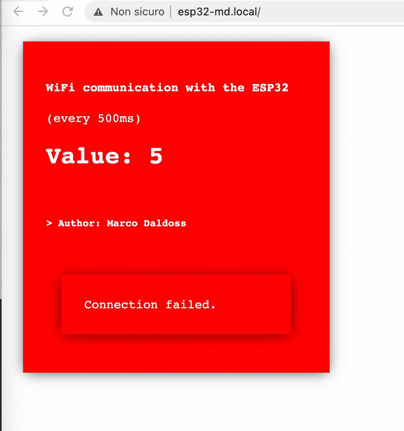

# ESP32: ESP32 WiFi Access Point Webserver Ajax and autorefresh

## What:
  ESP32 wifi Access point, Server, ajax, auto refresh, mDNS 
  This example shows how to:
  - set up an WiFi access point 
  - being able to connect using mDNS (connect through e.g. http://esp32-md.local)
  - Open and show a one page webserver
  - On the webpage a javascript do GET Request to update a counter value using Ajax (without loading the full page, but only the part of the website needed) 
  - Perform automatically the counter value update every 500ms

## Usage:
  0. Compile and Load the firmware using Arduino IDE
  1. Connect to the access point "ESP32-AP" insert password "password"
  2. Point your web browser to http://192.168.4.1/ or http://esp32-md.local 
  3. it will start showing a value changing every 500ms. The background colour will change too as soon as a new value is ready
  4. Red box will appear if the connection is lost.

 
 E.g. GUI:

 
 
## About 
 **Author:** Created by Marco Daldoss,   [Marco Daldoss](https://www.linkedin.com/in/marcodaldoss/) 

  for [arduino-esp32](https://github.com/espressif/arduino-esp32) on 16 Sept, 2021
  inspired by Elochukwu Ifediora (fedy0) and [circuitsforyou.com](circuitsforyou.cpom)

   
